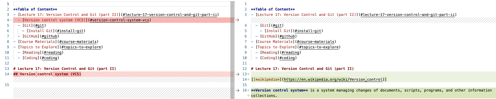
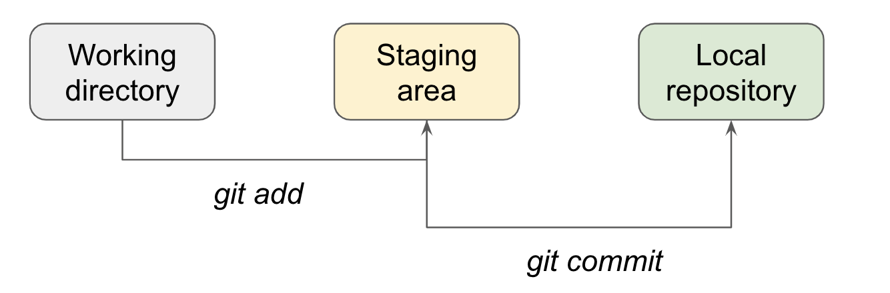
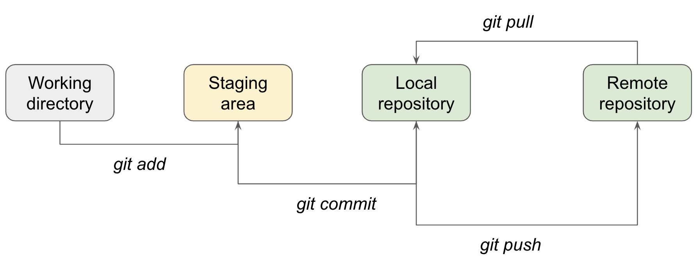
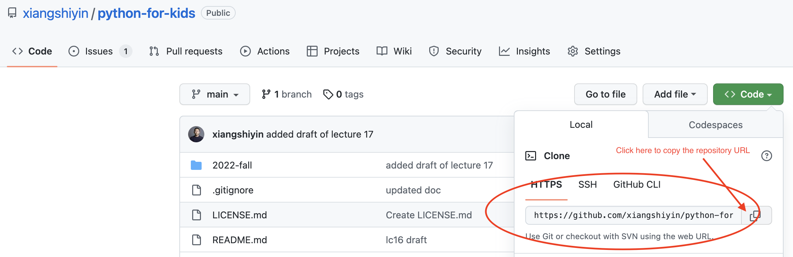

**Table of Content**
- [Lecture 17: Version Control and Git (part II)](#lecture-17-version-control-and-git-part-ii)
  - [Version control system (VCS)](#version-control-system-vcs)
  - [Git](#git)
    - [Install Git](#install-git)
    - [Initialize `git`](#initialize-git)
    - [Use `git`](#use-git)
    - [Common `git` commands](#common-git-commands)
  - [GitHub](#github)
- [Course Materials](#course-materials)
- [Topics to Explore](#topics-to-explore)
  - [Reading](#reading)
  - [Coding](#coding)

# Lecture 17: Version Control and Git (part II)
## Version control system (VCS)
[[*wikipedia*](https://en.wikipedia.org/wiki/Version_control)]

**Version control system** is a system managing changes of documents, scripts, programs, and other information collections. Instead of saving the complete historical copies of information, saving the differences or changes apparently is the more efficient way. 

Here is an example where the version control system is only tracking which lines were removed from the original document (*Left, highlighted in red color*) and which lines were added (*right, highlighted in green color*).


If we group changes into batches, you could probably think the whole system as a chain of nodes (in the simpliest scenario) where each node is a checkpoint saving a group of changes (`+/-`) made in a certain time interval and all the nodes are sorted (`old --> new`) based on when the changes were made in time.


## Git
[[*Official documentation on Git*](https://git-scm.com/book/en/v2)]

**Git** is a free and open source distributed (check [here](https://git-scm.com/book/en/v2/Getting-Started-About-Version-Control) on why a distributed system is in need) version control system designed to handle everything from small to very large projects with speed and efficiency. It can be used in a local system to track the information changes at local, and it could also be used across multiple computers such that people could collaborate on projects from different machines. 

### Install Git
* You can follow the [official document](https://git-scm.com/book/en/v2/Getting-Started-Installing-Git) on the suggested installation procedures for different operating systems (Linux, Mac, Windows, etc.)

### Initialize `git`
Check the [official documentation](https://git-scm.com/book/en/v2/Getting-Started-First-Time-Git-Setup) for more details.
* You can set some global level user information so that `git` knows who is making the code changes, some commands like 
  ```sh
  git config --global user.email "me@example.com"
  git config --global user.name "my name"
  ```
* Then you can either start a new project folder from scratch at local or clone a remote one to local
  * To start from scratch at local
    * Create a new project folder
    * Navigate to the folder location from your command line console (`Terminal` app in Mac or `Powershell`/`Command Line Prompt` in Windows)
    * Run command `git init` to let `git` start tracking all the file changes happening under the project folder
  * To clone a remote repository
    * Navigate to the remote repository page in your browser
    * Click the green color `Code` button on the page, copy the url
    * Navigate to the location where you want to land the code from your command line console, run the command `git clone <url>` to download the remote code repository (also called *`repo`*)

### Use `git`
In the local `git` use cases, there are three major components in the `git` tracking system. You can think these three components as three parallel universes where changes to the same file system could happen.
* Working directory - this is the area where you are directly working on, any changes you made here are not tracked by `git`.
* Staging area - this is the first stop for the changes you told `git` to track. You can tell `git` on what to track by running the command `git add`, then `git` will copy all the changes you made in the working directory to the staging area.
* Local repository - this is the area contains the changes `git` has tracked or saved. When you run the command `git commit`, `git` will move all the changes in the staging area here.



### Common `git` commands  

[[*reference*](http://guides.beanstalkapp.com/version-control/common-git-commands.html)]

* `git clone`
* `git pull`
* `git status`
* `git add`
* `git commit`
* `git log`
* `git push`


## GitHub
Git is an open-source, version control tool created in 2005 by developers working on the Linux operating system; GitHub is a company founded in 2008 that makes tools which integrate with git. It is the single largest host for Git repositories, and is the central point of collaboration for millions of developers and projects. You do not need GitHub to use git, but you cannot use GitHub without using git.

GitHub could be used to save the remote repository for code collaborations and could also be used a backup for the local code work. When a remote repository at GitHub comes into play, the data flow will change to be something like following



# Course Materials
[*slides*](https://docs.google.com/presentation/d/1a1289OL3w2VrFUuHJdm2g0owMQS-m0t8jVIr3-YTh5g/edit#slide=id.p)


# Topics to Explore
## Reading
- Git - the official documentation [[*link*](https://git-scm.com/book/en/v2)]
  - This is a very easy to read document. I think this is the best book to learn how to use `git` if you are interested.
- A good read on the local `git` commit system [[*link*](https://medium.com/@lucasmaurer/git-gud-the-working-tree-staging-area-and-local-repo-a1f0f4822018)]
## Coding
- **Task 1**: Install `git` to your computer following the instructions [above](#install-git)
- **Task 2**: Clone [the whole repository for our class](https://github.com/xiangshiyin/python-for-kids) to your local computer with `git` command `git clone <repository url>`
  -  In Windows, you will probably need the `git bash` software that comes with the `git` installation to execute your git commands and the file directory navigations (if you need) like I demoed in our class today. [Here](https://www.simplilearn.com/tutorials/git-tutorial/git-installation-on-windows) is more about `git` and `git bash` in Windows.
  -  In MacOS, you can open `Terminal` to run the `git` command and file directory navigations (if you need) like I demoed in our class today
  -  In order to navigate to different directories through command line, you can use the `cd` command. [Here](https://www.hostinger.com/tutorials/linux-commands) is some document to read. The same command works for both `Terminal` in MacOS and `git bash` in Windows.
- **Task 3**: Create a new Github repository of your own
  - Step 1: Create a github account at www.github.com
  - Step 2: Log into your Github account and create a new code repository of your own
  - Step 3: Navigate to the local computer directory where you want to land your code via command line
  - Step 4: Run command `git clone <repository url>` to clone the new repository you created on Github to your local directory
  
  - Step 5: Add at least 2 commits to the repository and push it back to GitHub as shown in our class by command `git push origin main`
  - Step 6: Add new comments to [this github issue](https://github.com/xiangshiyin/python-for-kids/issues/1) and share the url link to the github repository you created


