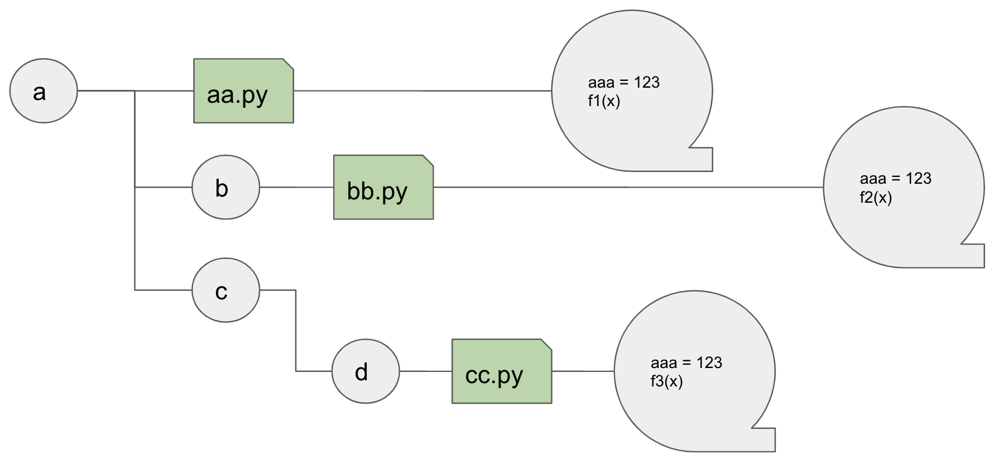
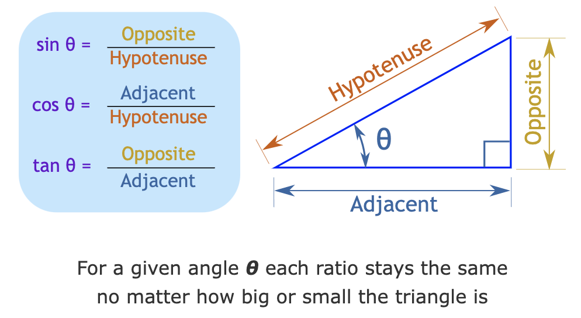
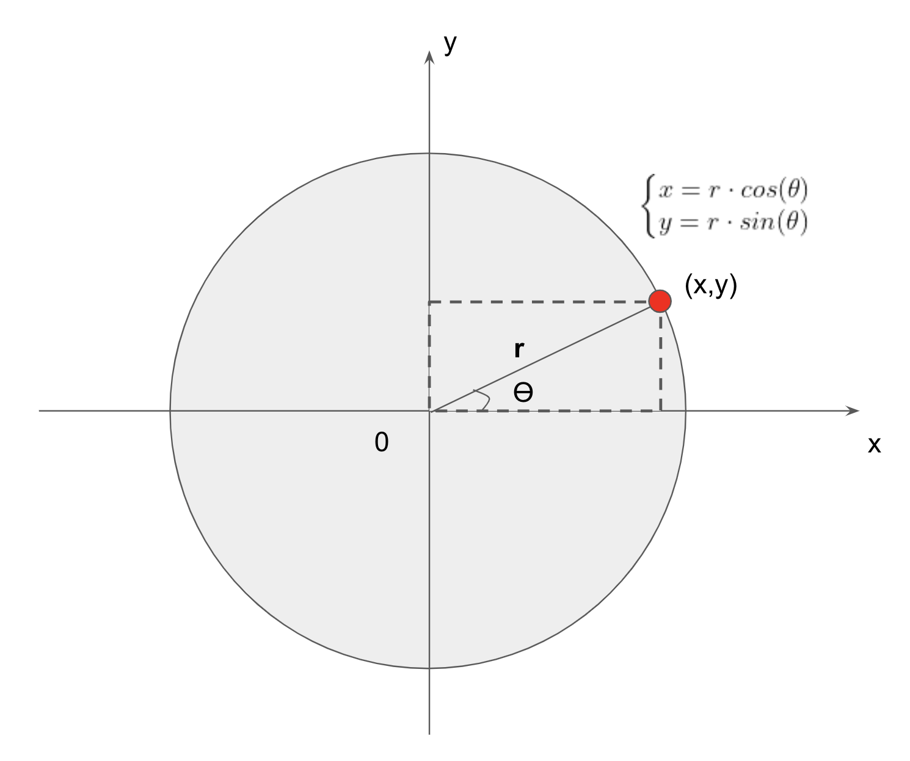

**Table of Content**
- [Lecture 18: Python Libraries and How To Use Them](#lecture-18-python-libraries-and-how-to-use-them)
  - [What are libraries](#what-are-libraries)
  - [What can you do with Python libraries](#what-can-you-do-with-python-libraries)
  - [Examples](#examples)
  - [How do we use them (***We'll cover this in our next lecture***)](#how-do-we-use-them-well-cover-this-in-our-next-lecture)
    - [A simple Python package](#a-simple-python-package)
    - [Things might be more complicated](#things-might-be-more-complicated)
- [Course Materials](#course-materials)
- [Topics to Explore](#topics-to-explore)
  - [Reading](#reading)
  - [Coding](#coding)
    - [Q1. Draw a circle with `matplotlib`](#q1-draw-a-circle-with-matplotlib)
    - [Q2. Finish the `git` practice you didn't get time finish last week](#q2-finish-the-git-practice-you-didnt-get-time-finish-last-week)


# Lecture 18: Python Libraries and How To Use Them

## What are libraries

A Python library is a collection of well organized python scripts that can be reused in different programs to tackle specific problems. It is created such that you could stand on the shoulders of the giants without reinventing the wheels. It also makes Python programs more concise and let people focus on core logics instead of utility functions.
## What can you do with Python libraries

## Examples
Check the code samples [here](./practice.ipynb)
* `string`
* `math`
* `matplotlib`

## How do we use them (***We'll cover this in our next lecture***)
### A simple Python package
Assume we have a package with the following file distribution
```md
└── sample_package
    └── sample.py
    └── subpackage
        └── subsample.py
```
The content of `sample.py` is like
```python
x = 123
y = 234

def hello():
    print('Hello World')
```

The content of `subsample.py`
```python
xx = 1
yy = 2
```

### Things might be more complicated


***You could***
* `import` the whole library, by `import a`
* `import` a module (python script), by `import a.aa`
* `import` a object (variable, function, class, etc.) in a module, by `import a.aa.aaa`


**However**, you should keep using the `<object>` name in the `import <object>` statement in your program to reference the object you imported. **Sometimes, this could be quite inconvenient** because the `<object>` string could be pretty long due to the complicatedd file structures in the python library

**There are two ways** to solve the problem:
* `from a import aa` (use the `from` statement to reference the complicated folder relationships)
* `import a.aa as aa` (create an alias)


# Course Materials
[*slides*](https://docs.google.com/presentation/d/1vzOVB10gz5SWs2NAn4XTrTPJgcqr2_Y8niDloIQi7-A/edit?usp=sharing)


# Topics to Explore
## Reading
* Top 10 Python libraries [[*link*](https://www.interviewbit.com/blog/python-libraries/#:~:text=With%20more%20than%20137%2C000%20libraries,data%20manipulation%2C%20and%20many%20more.)]

## Coding
### Q1. Draw a circle with `matplotlib`
Give it a try to the coding problem we didn't get time to finish [[jupyter notebook](./practice.ipynb)]
* **Background** information on `sine` and `cosine` functions in geometry
  
  * Reading
    * https://www.mathsisfun.com/sine-cosine-tangent.html
    * https://en.wikipedia.org/wiki/Sine_and_cosine
* As we discussed in today's class, coordinates of all points on a circle can be expressed by the circle radius and the corresponding angle $\theta$ via function $\cos(\theta)$ and $\sin(\theta)$ as following. The range of the $\theta$ value is $[0, 2\pi]$ where the constant $\pi \approx 3.1415927$

  

* Maybe we should first revisit the code we used to draw the straight line and see what we did step by step? **Can we repeat a similar coding pattern as this one?**

    ```python
    # import the plot library
    import matplotlib.pyplot as plt

    # create a list of x cooridnate values
    xs = list(range(-100, 100, 1))
    # create an empty list for y coordiante values such that we could fill y values in later
    ys = [] 

    # iterate through each individual x value
    for x in xs: 
        # calculate the corresponding y value and plug it into the empty list we created, y = x + 1
        ys.append(x + 1) 

    # feed the lists of x and y coordinate values to the plot() function
    plt.plot(xs,ys,label='y = x + 1',marker='o') 
    plt.show()
    ```

### Q2. Finish the `git` practice you didn't get time finish last week 
- [[*link*](../2023-01-28/README.md)]