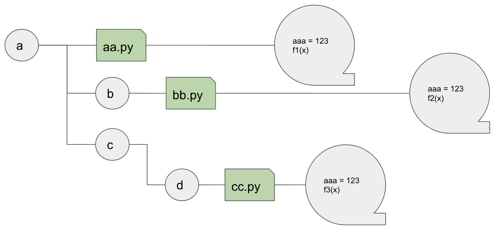

**Table of Content**
- [Lecture 19: Python Libraries and How To Use Them (part II)](#lecture-19-python-libraries-and-how-to-use-them-part-ii)
  - [How do we use a python library](#how-do-we-use-a-python-library)
    - [A simple Python package](#a-simple-python-package)
    - [Things might be more complicated](#things-might-be-more-complicated)
- [Course Materials](#course-materials)
- [Topics to Explore](#topics-to-explore)
  - [Reading](#reading)
  - [Coding](#coding)


# Lecture 19: Python Libraries and How To Use Them (part II)

## How do we use a python library
### A simple Python package
Assume we have a package with the following file distribution
```md
└── sample_package
    └── sample.py
    └── subpackage
        └── subsample.py
```
The content of `sample.py` is like
```python
x = 123
y = 234

def hello():
    print('Hello World')
```

The content of `subsample.py`
```python
xx = 1
yy = 2
```

### Things might be more complicated


***You could***
* `import` the whole library, by `import a`
* `import` a module (python script), by `import a.aa`
* `import` a object (variable, function, class, etc.) in a module, by `import a.aa.aaa`


**However**, you should keep using the `<object>` name in the `import <object>` statement in your program to reference the object you imported. **Sometimes, this could be quite inconvenient** because the `<object>` string could be pretty long due to the complicatedd file structures in the python library

**There are two ways** to solve the problem:
* `from a import aa` (use the `from` statement to reference the complicated folder relationships)
* `import a.aa as aa` (create an alias)


# Course Materials
[*slides*](https://docs.google.com/presentation/d/1To0QhYLt7tTitHHFYFsioEg2a1QCRC2IXJRTVX7sHl8/edit?usp=share_link)


# Topics to Explore
## Reading
TBD

## Coding
TBD
