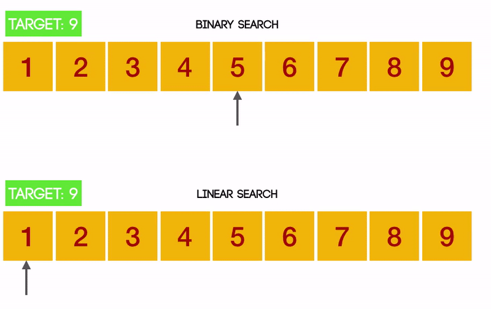

**Table of Content**
- [Lecture 26: Algorithm - Binary Search](#lecture-26-algorithm---binary-search)
  - [Lecture Topics](#lecture-topics)
    - [Harry Potter project wrapup](#harry-potter-project-wrapup)
    - [Different search algorithms (Linear Search vs. Binary Search)](#different-search-algorithms-linear-search-vs-binary-search)
- [Topics to Explore](#topics-to-explore)
  - [Reading](#reading)
  - [Coding](#coding)

# Lecture 26: Algorithm - Binary Search

## Lecture Topics

### Harry Potter project wrapup
- Utilize stop words
- Clean up the word list

### Different search algorithms (Linear Search vs. Binary Search)

# Topics to Explore

## Reading
TBD

## Coding
TBD