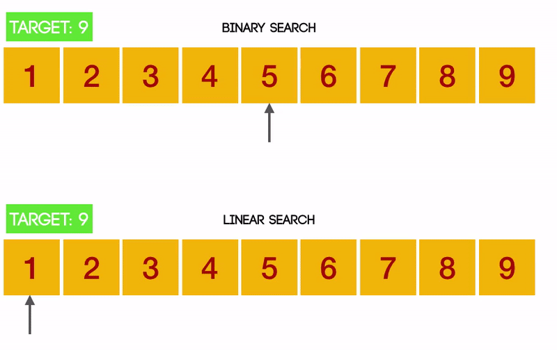
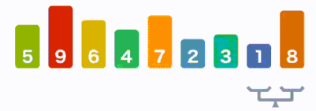

**Table of Content**
- [Lecture 27: Algorithm - Search and Sort](#lecture-27-algorithm---search-and-sort)
  - [Lecture Topics](#lecture-topics)
    - [Different search algorithms (Linear Search vs. Binary Search)](#different-search-algorithms-linear-search-vs-binary-search)
    - [Bubble Sort](#bubble-sort)
- [Topics to Explore](#topics-to-explore)
  - [Reading](#reading)
  - [Coding](#coding)

# Lecture 27: Algorithm - Search and Sort

## Lecture Topics
### Different search algorithms (Linear Search vs. Binary Search)

Question: Does it matter if the list is sorted or not?

### Bubble Sort

# Topics to Explore

## Reading
TBD

## Coding
TBD