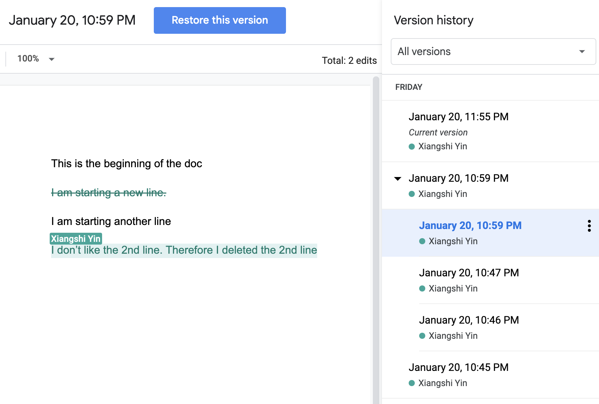

# Lecture 16: Version Control and Git

## Table of Content
1. [Version control](#1-version-control)
  * 1.1. [Compare two files](#11-compare-two-files)
  * 1.2. [Track file editing history](#12-track-file-editing-history)
2. [Version control system (VCS)](#2-version-control-system-vcs)
  * 2.1. [What is it](#21-what-is-it)
  * 2.2. [What is Git](#22-what-is-git)
  * 2.3. [Install Git](#23-install-git)
  * 2.4. [GitHub](#24-github)
3. [Course materials](#3-course-materials)
4. [Topics to explore](#4-topics-to-explore)


Today, We'll talk abou version control and git.

##  1. Version control
###  1.1. Compare two files
Assume you have two text files and you want to figure out if the two files contain exactly the same information. What would you do?
* *Method 1*: put two files side by side, eyeball the differences
* *Method 2*: an automatic way on your computer, use the `diff` command (on Linux or Mac)
    ```sh
    $ diff copy1.py copy2.py
    1,2c1,6
    < def division(dividend, divisor):
    <     pass
    ---
    >
    > def divison(dividend, divisor):
    >     quotient = dividend // divisor
    >     remainder = dividend % divisor
    >     return quotient, remainder
    >
    ```
  * You can even compare two different folders with the `diff` command
    ```sh
    $ diff 2022-fall/2023-01-21 2022-fall/2023-01-14
    diff 2022-fall/2023-01-21/README.md 2022-fall/2023-01-14/README.md
    1c1
    < # Lecture 16: Version Control and Git
    ---
    > # Lecture 15: Function (Part III)
    3c3
    < Today, We'll talk abou version control and git.
    ---
    > Today, We'll do some hands-on exercise to refresh our memory on functions
    Only in 2022-fall/2023-01-21: copy1.py
    Only in 2022-fall/2023-01-21: copy2.py
    Only in 2022-fall/2023-01-14: multiplication_puzzle.png
    Only in 2022-fall/2023-01-14: practice.ipynb
    ```
  (The equivalent command under Windows would be the `fc` command you can run under Command Prompt `fc file1Location file2Location`)
###  1.2. Track file editing history
* The google doc example - edit history


##  2. Version control system (VCS)
###  2.1. What is it

###  2.2. What is Git


###  2.3. Install Git
* [Official doc](https://git-scm.com/book/en/v2/Getting-Started-Installing-Git) - installation options for different operation systems (Linux, Mac, Windows, etc.)
* Initialize `git`
  * You can set some global level user information so that `git` knows who is making the code changes, some commands like 
    ```sh
    git config --global user.email "me@example.com"
    git config --global user.name "my name"
    ```
  * Then you can either start a new project folder from scratch at local or clone a remote one to local
    * To start from scratch at local
      * Create a new project folder
      * Navigate to the folder location from your command line console (`Terminal` app in Mac or `Powershell`/`Command Line Prompt` in Windows)
      * Run command `git init` to let `git` start tracking all the file changes happening under the project folder
    * To clone a remote repository
      * Navigate to the remote repository page in your browser
      * Click the green color `Code` button on the page, copy the url
      * Navigate to the location where you want to land the code from your command line console, run the command `git clone <url>` to download the remote code repository (also called *`repo`*)

* Common `git` commands  [[*reference*](http://guides.beanstalkapp.com/version-control/common-git-commands.html)]


### 2.4 GitHub


##  3. Course materials
* [slides](https://docs.google.com/presentation/d/1qz_i_qMgUabG9etnKgCWdsj0_SFi1-ih-wmdHhzKQ-8/edit#slide=id.p)

##  4. Topics to explore
* **Reading**
  
  TBD
* **Exercise**

  TBD


