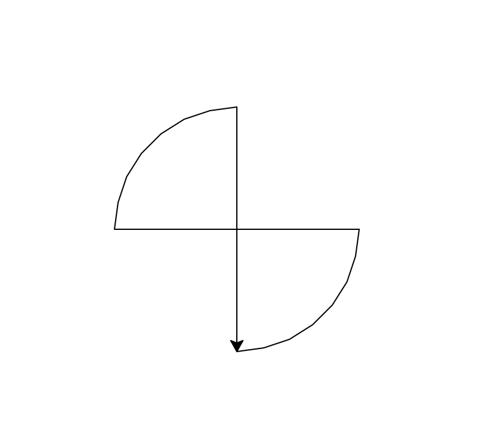

**Table of Contents**
- [Lecture 03: Primitive Data Types and Practices (Part I)](#lecture-03-primitive-data-types-and-practices-part-i)
  - [Lecture topics](#lecture-topics)
  - [Course materials](#course-materials)
  - [Topics to explore](#topics-to-explore)
    - [Read](#read)
    - [Exercise](#exercise)


# Lecture 03: Primitive Data Types and Practices (Part I)

## Lecture topics
* [x] Code exploration recap
  * Revisit the following code sample
    ```python
    import turtle

    t = turtle.Turtle()

    t.forward(100)
    t.right(90)
    t.forward(100)
    t.right(90)
    t.forward(100)
    t.right(90)
    t.forward(100)
    t.right(90)
    turtle.done()
    ```
  * Can you plot a different shape?
    * Rectangle
    * Triangle - equilateral triangle
    * Pentagon (**homework**)
    * Hexagon
* [x] Numeric Data
  * Common arithmetic operations
    | Operation | Result                           |
    | --------- | -------------------------------- |
    | x + y     | sum of x and y                   |
    | x - y     | difference of x and y            |
    | x * y     | product of x and y               |
    | x / y     | quotient of x and y              |
    | x // y    | floored quotient of x and y      |
    | x % y     | remainder of x / y               |
    | -x        | x negated                        |
    | +x        | x unchanged                      |
    | abs(x)    | absolute value or magnitude of x |
    | pow(x, y) | x to the power y                 |
    | x ** y    | x to the power y                 |
  * Practice
    * How many different numbers can a byte represent?
    * How to tell if an input number is even or odd?
    * Find out all the factors of a given integer
* [ ] String Data (didn't get time to cover)
  * Use different quotation marks
  * Special characters
  * Check the length of a string with `len()`
  * `+` and `*` operators
  * Change the cases with `str.lower()` and `str.upper()`
  * String indexing
    * Each character of the string is assigned a index number representing its position in the string, and index number starts from 0
    * General indexing format - `StringValue[<lower_index>:<upper_index>]`
      * `<lower_index>` is inclusive
      * `<upper_index>` is exclusive
      * Negative indexing
    * Practice
      * For an input name, find out the total length
      * For an input name, find out the first and last names
      * Introduce a person based on information input from keyboard
      * Bake a cake!!


## Course materials
* [slides](https://docs.google.com/presentation/d/1Sf5f1W3PRBdATVS_kxllzcLvBacz1ohsKol-SnJA7tg/edit?usp=sharing)

## Topics to explore
### Read
We used the Python library `turtle` and made some fun drawings in our class. Here are some relevant reading for this Python library if you want to learn more and make more interesting shapes with it
* A quick tutorial on `turtle` [[link](https://docs.python.org/3/library/turtle.html#tutorial)]

### Exercise
* Q1: Write a program to draw a regular pentagon with `turtle` and make sure all five sides are of the same length.
  * Hint: make changes on top of the code samples we used in our class today. Can you figure out the right size of angle to turn in the program?
* Q2: Allie and Philip were asking how to draw a circle with `turtle`. Here is one example you could play with. Can you figure out how this code works?
  ```python
  # draw a circle with Turtle
  import turtle

  t = turtle.Turtle()
  radius = 100
  t.circle(radius)
  turtle.done()
  ```
* Q3: Can you figure out a way to draw a shape like this? 
  * Hint: maybe you could borrow some logic from Q2 above?
