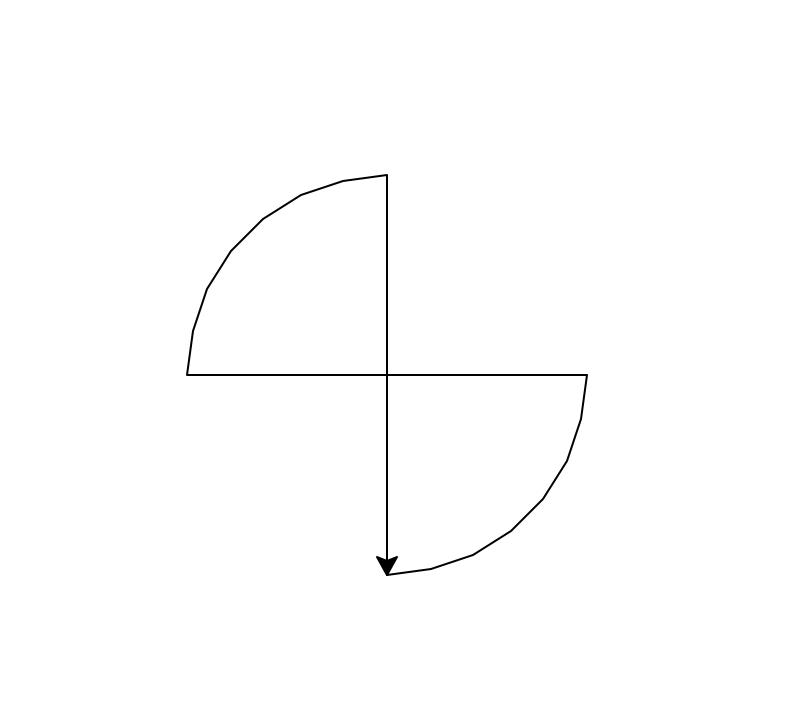

**Table of Contents**
- [Lecture 04: Primitive Data Types and Practices (part II)](#lecture-04-primitive-data-types-and-practices-part-ii)
  - [Lecture topics](#lecture-topics)
  - [Course materials](#course-materials)
  - [Topics to explore](#topics-to-explore)
    - [Read](#read)
    - [Exercise](#exercise)


# Lecture 04: Primitive Data Types and Practices (part II)

## Lecture topics
* [x] Code assignment recap
  * Q1. Draw a regular pentagon with `turtle`
  * Q2. Draw a circle with `turtle`
  * Q3. Draw a shape like below 
* More practices on numbers
  * How many different numbers can a *byte* represent?
    * [`Decimal` system](https://en.wikipedia.org/wiki/Decimal) vs. [`Binary` system](https://en.wikipedia.org/wiki/Binary_number)
* [x] String Data
  * Use different quotation marks
  * Special characters
  * Check the length of a string with `len()`
  * `+` and `*` operators
  * Change the cases with `str.lower()` and `str.upper()`
  * String indexing
    * Each character of the string is assigned a index number representing its position in the string, and index number starts from 0
    * General indexing format - `StringValue[<lower_index>:<upper_index>]`
      * `<lower_index>` is inclusive
      * `<upper_index>` is exclusive
      * Negative indexing
    * `f-string`
      * ```python
        a = 3
        b = 2
        c = a + b
        f'{b} plus {a} is {c}'      
        ```
    * Alignment format
      * `"{:>10}".format("Test")`
      * `"{:<10}".format("Test")`
      * `"{:^10}".format("Test")`
      * A different approach
        * `"Test".ljust(10, '*')`
        * `"Test".rjust(10, '*')`
        * `"Test".center(10, '*')`
    * Practice
      * For an input name, find out the total length
      * For an input name, find out the first and last names
      * Introduce a person based on information input from keyboard
      * Check if a string is a part of another string
        * What is the first occurrence?
      * Bake a cake!!
  


## Course materials
* [slides](https://docs.google.com/presentation/d/1sO_7PW4qL3dMckd6r7lQ9o7cYgOJdGzR3owE0shzVPE/edit?usp=sharing)

## Topics to explore
### Read
* Read about `f-string` [[reference](https://www.geeksforgeeks.org/formatted-string-literals-f-strings-python/)]

### Exercise
* Review the code presented in our Saturday class
  * [sample_1.py](./sample_1.py)
  * [sample_2.py](./sample_2.py)
  * [sample_3.py](./sample_3.py)
  * [sample_4.py](./sample_4.py)
  * [code_demo.py](./code_demo.py)
