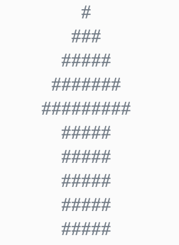

**Table of Contents**
- [Lecture 06: Boolean and Condition](#lecture-06-boolean-and-condition)
  - [Lecture topics](#lecture-topics)
  - [Course materials](#course-materials)
  - [Topics to explore](#topics-to-explore)
    - [Read](#read)
    - [Exercise](#exercise)


# Lecture 06: Boolean and Condition

## Lecture topics
* String
  * [ ] Practice - **Follow a pattern, create your own code**
    * Can you follow the pattern([pattern_1](../2023-09-16/sample_5.py), [pattern_2](../2023-09-16//sample_6.py)) used by the end of our class to print a pattern like below?
    * **How about this one?** - What is the first occurrence of `str1` in `str2`?
        ```
        Type in the 1st string: ab
        Type in the 2nd string: bcabcdabcde
        >> Output: The 1st string ab is in the 2nd string bcabcdabcde
        >> Output: The first occurrence of string ab in the 2nd string bcabcdabcde is at position 2
        ```
* [ ] Boolean - `True/False`
  * [ ] Comparison is the most common way to generate `True/False` values
    | Operator | Meaning                         |
    | -------- | ------------------------------- |
    | A > B    | A is greater than B             |
    | A < B    | A is smaller than B             |
    | A == B   | A is equal to B                 |
    | A != B   | A is not equal to B             |
    | A >= B   | A is greater than or equal to B |
    | A <= B   | A is smaller than or equal to B |
  * [ ] Evaluating if a `fact` is (`equal to`) `True` could also generate `True/False` values
    * `'ab' in 'abc'`
  * [ ] Logical operators - Consider multiple scenarios
    | Operator   | Meaning |
    | ---------- | ------- |
    | `and`, `&` | AND     |
    | `or`, `\|` | OR      |
    | `not`, `!` | NOT     |
  * [ ] Practice
    * Check if the input number is divisible by number 2
    * Check if the input number is divisible by number 4
    * Check if the input number is divisible by either 2 and 4
    * Check if the input number is divisible by either 2 or 4
* [ ] `Indentation` in Python
  * The Python language design is distinguished by its emphasis on readability, simplicity, and explicitness. Some people go so far as to liken it to "executable pseudocode"
  * Python uses whitespace (tabs or spaces) to structure code instead of using braces as in many other languages like R, C++, Java, and Perl. Consider a for loop from a sorting algorithm, such as:
      ```python
      if x >= 5:
          print(f"x is greater or equal to 5")
      else:
          print(f"x is smaller than 5")
      ```
  * In C++, the same code could be like
      ```cpp
      if (x >= 5) {
          std::cout << "x is greater or equal to 5" << std::endl;
      } else {
          std::cout << "x is smaller than 5" << std::endl;
      }      
      ```
  * A colon denotes the start of an indented code block after which all of the code must be indented by the **same amount** until the end of the block
  * `Indentation` here means - **X consecutive spaces**
    * There is no restrictions on the amount of spaces to use as long as you always stick to the same amount. However, **4 consecutive spaces** is the general standard people follow
    * Many text editors have a setting that will replace tab stops with spaces automatically
  * Semicolons can be used, however, to separate multiple statements on a single line:
      ```python
      a = 5; b = 6; c = 7
      ```
    * Putting multiple statements on one line is generally discouraged in Python as it can make code less readable.


## Course materials
* [slides](https://docs.google.com/presentation/d/1tl7osBenIFke2zIx4_u_5IY2Mk9aGCz0473HkhcUfo4/edit?usp=sharing)

## Topics to explore
### Read
TBD

### Exercise
TBD
