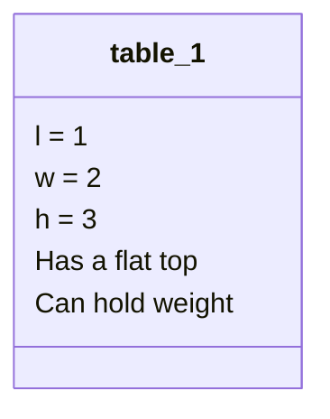
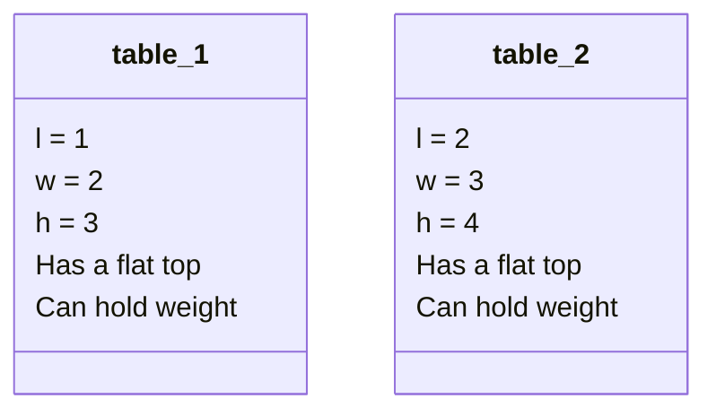
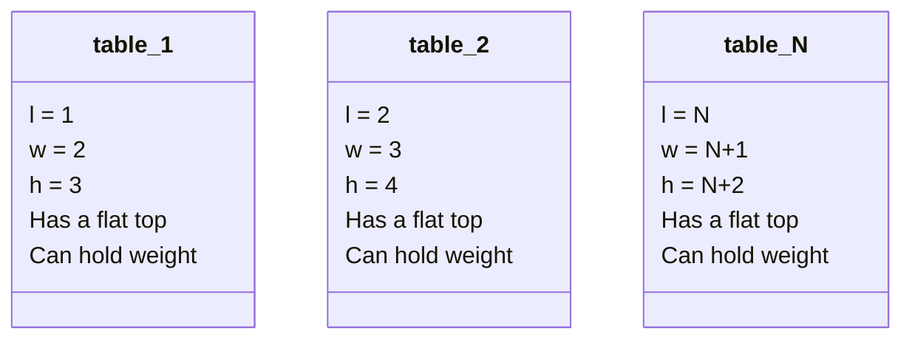
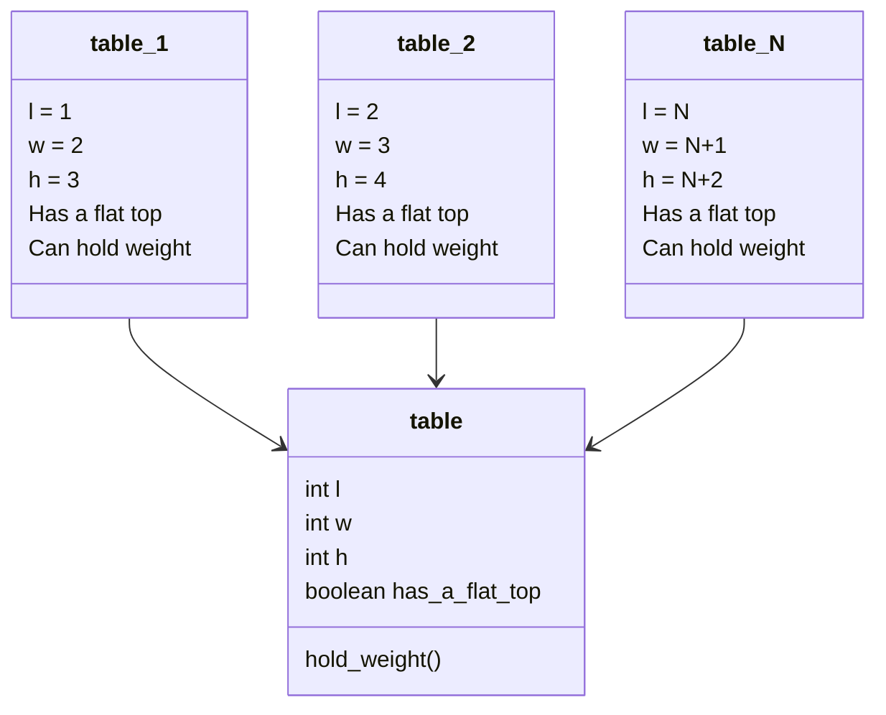
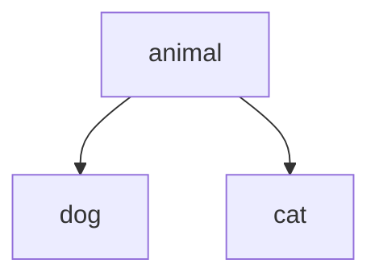

**Table of Content**
- [Lecture 15: Class and Objects](#lecture-15-class-and-objects)
  - [Describe a table](#describe-a-table)
  - [Class and Objects in Python](#class-and-objects-in-python)
    - [Definition](#definition)
    - [Create a class in Python](#create-a-class-in-python)
  - [Class inheritance](#class-inheritance)
- [Topics to Explore](#topics-to-explore)
  - [Reading](#reading)
  - [Coding](#coding)

# Lecture 15: Class and Objects

## Describe a table
How do you describe a table?


How about 2 tables?


How about many tables?


How do you describe the concept `table` to an audience who doesn't know what a table is?

Do you see what happened here?
- We created a **class** `table` to represent a group of **objects** - tables
- All table **objects** of the **class** `table` share some common **properties** and **functions**
  - Different **objects** might have different values for the same **attribute**

## Class and Objects in Python
### Definition
In general
- A `class` is a blueprint for declaring and creating objects
- An `object` is a class instance that allows programmers to use variables and methods from inside the class
- A class defines a set of `attributes` (`<--> properties`) and `methods` (`<--> functions`) that the objects of that class will have.

### Create a class in Python

```python
class table:
    # constructor method
    def __init__(self, l, w, h):
        self.l = l
        self.w = w
        self.h = h
        self.has_a_flat_top = True
    
    # regular/instance method
    def hold_weight(self, weight):
        print('Holding a weight of {weight} kg')
```

To create a table (**object**), we can do
```python
table_1 = table(l=1, w=2, h=3)
# or
table_1 = table(1, 2, 3)
```

You can access the `attributes` and `methods` of class `table` use the following pattern
```python
table_1.l
table_1.w
table_1.h
table_1.has_a_flat_top
table_1.hold_weight(weight=10)
```

## Class inheritance
In Python, `class inheritance` is a mechanism by which a new class can be created from an existing class, inheriting its attributes and methods. The new class is called a `subclass` or `derived class`, while the existing class is called the `superclass` or `base class`.

To create a subclass in Python, you can define a new class that inherits from the superclass using the syntax `class Subclass(Superclass)`



```python
class Animal:
    def __init__(self, name):
        self.name = name

    def speak(self):
        pass

class Dog(Animal):
    pass

class Cat(Animal):
    pass

```

# Topics to Explore

## Reading
- Python classes and objects [[link](https://www.programiz.com/python-programming/class)]
- Object oriented programming in Python [[link](https://realpython.com/python3-object-oriented-programming/)]

## Coding
- Q1. Create a class `car` that has the followng attributes (properties) and methods (functions)
  - Attributes 
    - size (subcompact, compact, mid-size, full-size, suv, truck, van, etc.)
    - power source
  - Method
    - move (feel free to define whatever actions that make sense for this method)
- Q2. Create an object `tesla` that inheritates the class `car`
  - Add an additional method `charge` (feel free to define whatever actions that make sense for this method)
