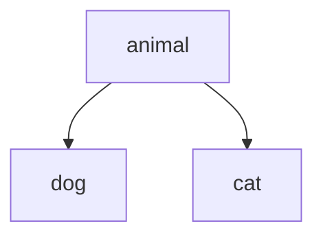

**Table of Content**
- [Lecture XX: The Title](#lecture-xx-the-title)
  - [Topics](#topics)
  - [Concepts](#concepts)
    - [Class vs. Object/Instance](#class-vs-objectinstance)
    - [Class Definition](#class-definition)
    - [Class Inheritance](#class-inheritance)
  - [Practice](#practice)
  - [Course materials](#course-materials)
- [Suggested reading](#suggested-reading)

# Lecture XX: The Title

## Topics
Here are the topics we are going to cover
* [ ] Exercises: class and objects
* [ ] Class inheritance
* [ ] Special topics
  * [ ] Global variable
  * [ ] Python decorators


## Concepts
### Class vs. Object/Instance
* `Class`: a type of "things". Example: `int`, `string`, `car`
* `Object/Instance`: an instance of a class. Example: `123`, `'abc'`, `tesla model-x`

### Class Definition
```python
class Car:
    # Class attribute
    wheels = 4

    # Constructor method (initializer)
    def __init__(self, make, model):
        # Instance attributes
        self.make = make
        self.model = model

    # Instance method
    def display_info(self):
        print(f"{self.make} {self.model} - {self.wheels} wheels")

# Creating an instance of the Car class
my_car = Car(make="Toyota", model="Camry")

# Accessing attributes and calling methods
print(f"Make: {my_car.make}")
print(f"Model: {my_car.model}")
my_car.display_info()
```

### Class Inheritance
In Python, `class inheritance` is a mechanism by which a new class can be created from an existing class, inheriting its attributes and methods. The new class is called a `subclass` or `derived class`, while the existing class is called the `superclass` or `base class`.

To create a subclass in Python, you can define a new class that inherits from the superclass using the syntax `class Subclass(Superclass)`



```python
class Animal:
    def __init__(self, name):
        self.name = name

    def speak(self):
        pass

class Dog(Animal):
    pass

class Cat(Animal):
    pass

```

## Practice
* Q1. Create a bank with methods to deposit, withdraw, and check balance
* Q2. Create a calculator with methods to add, subtract, multiplication, and divisions for two input numbers
* Q3. Create a class that mimics numeric types in python with methods to add, subtract, multiplication, and division

## Course materials
* slides [TBD]

# Suggested reading
* TBD
* Online resources
  * TBD
