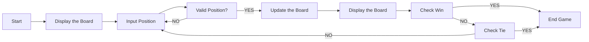
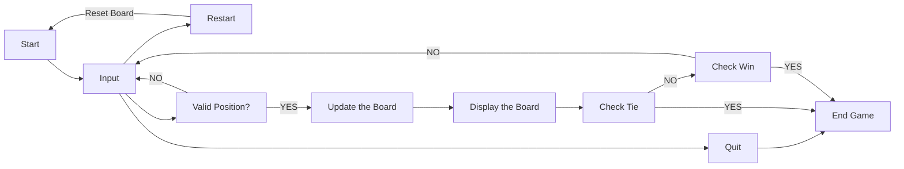

**Table of Content**
- [Lecture 17: Build a Tic-Tac-Toe Game](#lecture-17-build-a-tic-tac-toe-game)
  - [Topics](#topics)
  - [Questions](#questions)
  - [Flow Chart](#flow-chart)
    - [Case #1](#case-1)
    - [Case #2](#case-2)
  - [Course materials](#course-materials)
- [Suggested reading](#suggested-reading)
- [Assignment](#assignment)

# Lecture 17: Build a Tic-Tac-Toe Game

## Topics
In this lecture, we are going to build a tic-tac-toe game together
* Reference: https://www.youtube.com/watch?v=Q6CCdCBVypg&ab_channel=CDcodes

## Questions
* What do we need to set up the game?
* What are the rules?
* What could be the possible states of the game?
* What input do we need?
* What output do we need?

## Flow Chart
### Case #1

### Case #2

## Course materials
* slides [[link](TBD)]

# Suggested reading
* (Good to read, we'll catch this up later) Build a tic-tac-toe game with GUI (graphic user interface): https://realpython.com/tic-tac-toe-python/

# Assignment
* Add additional functions to
  * Check abnormal input (invalid position)
  * Enable game reset
  * Enable existing the game
* Optimize the code we created [[code](./tic-tac-toe.py)]