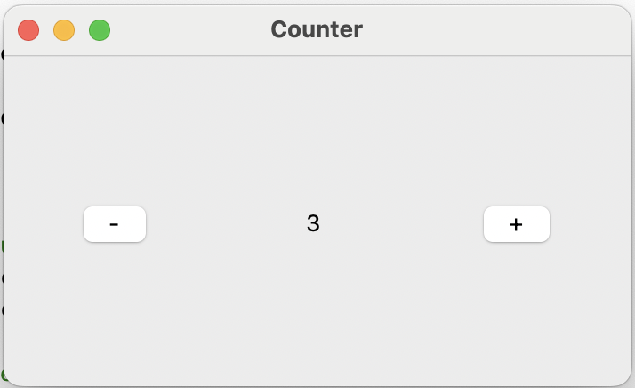

**Table of Content**
- [Lecture 20: Build a Tic-Tac-Toe Game (part IV)](#lecture-20-build-a-tic-tac-toe-game-part-iv)
  - [Topics](#topics)
  - [Recap](#recap)
  - [Course materials](#course-materials)
- [Coding assignment](#coding-assignment)

# Lecture 20: Build a Tic-Tac-Toe Game (part IV)

## Topics
In today's class, we are going to finish the GUI for the tic-tac-toe game
* **Practice 1**: Build a GUI `counter` to interactively change the displayed value
* **Practice 2**: Build a GUI of the tic-tac-toe game board where marks can be placed by clicking on the buttons
* **Practice 3**: Improve the GUI of the tic-tac-toe game board by alternating the mark of the player
* **Practice 4**: Implement the game logic to check for a winner
* **Practice 5**: Implement the game logic to check for a draw
* **Practice 6**: Implement the logic to add a popup message when the game is over

## Recap
* In [demo1.py](./demo1.py), we introduced code to handle the auto-adjustment of the button position when dragging the whole window
* In [demo2.py](./demo2.py), we built a small counter UI to interactively react to the button clicks 
* In [demo3.py](./demo3.py), we enhanced the 3x3 game board by labeling the buttons clicked with a hard-coded mark "X"
* In [demo4.py](./demo4.py), we rewrote `demo3.py` in a *class* `game` and introduced instance attributes that it could behavior like a global variable and help alternate the marks to lay on the clicked buttons. We also made sure that clicked buttons shouldn't be activated again.

## Course materials
* slides [TBD]

# Coding assignment
* Can you add code [between Line 30 and Line 35](./demo4.py#L30-L35) of `demo4.py` such that
  * We could check if there is a winner after every single move
  * We could check if there is a tie after every single move
