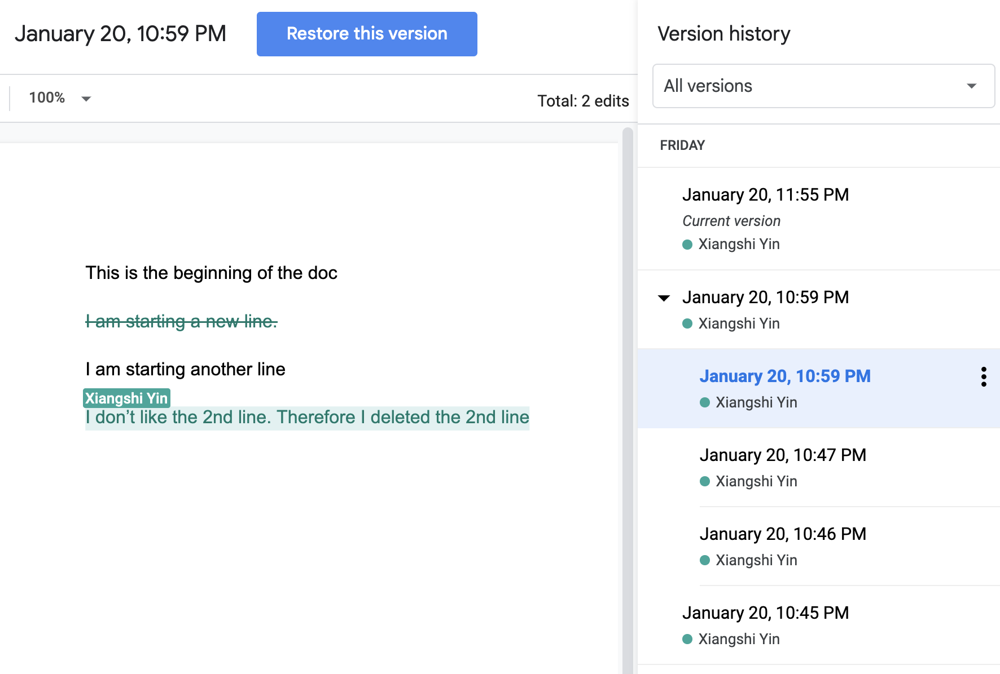

**Table of Content**
- [Lecture 25: Version Control and Git](#lecture-25-version-control-and-git)
  - [Topics](#topics)
  - [Concepts](#concepts)
    - [Version control](#version-control)
      - [Compare two files](#compare-two-files)
    - [Track file editing history](#track-file-editing-history)
  - [Install Git](#install-git)
  - [Course materials](#course-materials)
- [Suggested reading](#suggested-reading)

# Lecture 25: Version Control and Git

## Topics
Here are the topics we are going to cover
* [ ] Word frequency ranking in Harry Potter
* [ ] Introduction to version control
* [ ] Introduction to Git


## Concepts
###  Version control
####  Compare two files
Assume you have two text files and you want to figure out if the two files contain exactly the same information. What would you do?
* *Method 1*: put two files side by side, eyeball the differences
* *Method 2*: an automatic way on your computer, use the `diff` command (on Linux or Mac)
    ```sh
    ❯ diff 2023-2024/2024-04-13/copy1.py 2023-2024/2024-04-13/copy2.py
    0a1
    >
    2c3,6
    <     pass
    ---
    >     quotient = dividend // divisor
    >     remainder = dividend % divisor
    >     return quotient, remainder
    >
    ```
  * You can even compare two different folders with the `diff` command
    ```sh
    ❯ diff 2023-2024/2024-03-23/ 2023-2024/2024-04-13/
    ```
  (The equivalent command under Windows would be the `fc` command you can run under Command Prompt `fc file1Location file2Location`)
###  Track file editing history
* The google doc example - edit history


##  Install Git
* [Official doc](https://git-scm.com/book/en/v2/Getting-Started-Installing-Git) - installation options for different operation systems (Linux, Mac, Windows, etc.)
* Initialize `git`
  * You can set some global level user information so that `git` knows who is making the code changes, some commands like 
    ```sh
    git config --global user.email "me@example.com"
    git config --global user.name "my name"
    ```
  * Then you can either start a new project folder from scratch at local or clone a remote one to local
    * To start from scratch at local
      * Create a new project folder
      * Navigate to the folder location from your command line console (`Terminal` app in Mac or `Powershell`/`Command Line Prompt` in Windows)
      * Run command `git init` to let `git` start tracking all the file changes happening under the project folder
    * To clone a remote repository
      * Navigate to the remote repository page in your browser
      * Click the green color `Code` button on the page, copy the url
      * Navigate to the location where you want to land the code from your command line console, run the command `git clone <url>` to download the remote code repository (also called *`repo`*)

* Common `git` commands  [[*reference*](http://guides.beanstalkapp.com/version-control/common-git-commands.html)]

## Course materials
* slides [[link](https://docs.google.com/presentation/d/1V3UgsJ_vXLN_qYO2Xe-VDvUkvW_6z8zKf4HqK8BzfAQ/edit?usp=sharing)]

# Suggested reading
* TBD
* Online resources
  * TBD
