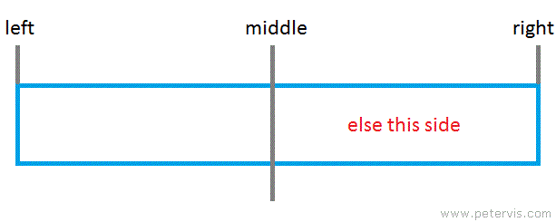
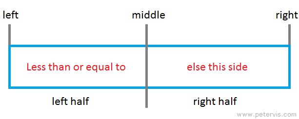

**Table of Content**
- [Lecture 28: Algorithm (part II) - Search \& Sort](#lecture-28-algorithm-part-ii---search--sort)
  - [Topics](#topics)
  - [Concepts](#concepts)
    - [Linear Search](#linear-search)
    - [Binary Search](#binary-search)
  - [Course materials](#course-materials)
- [Suggested reading](#suggested-reading)

# Lecture 28: Algorithm (part II) - Search & Sort

## Topics
Here are the topics we are going to cover
* [ ] Compare linear search and binary search
* [ ] Bubble sort algorithm
* [ ] School year recap

## Concepts
### Linear Search

### Binary Search

## Course materials
* slides [TBD]

# Suggested reading
- Bubble sort introduction [[link](https://helloacm.com/teaching-kids-programming-bubble-sorting-simple-sorting-algorithm/)]
- Different sorting algorithms [[link](https://kidscodecs.com/sorting-algorithms/)]
