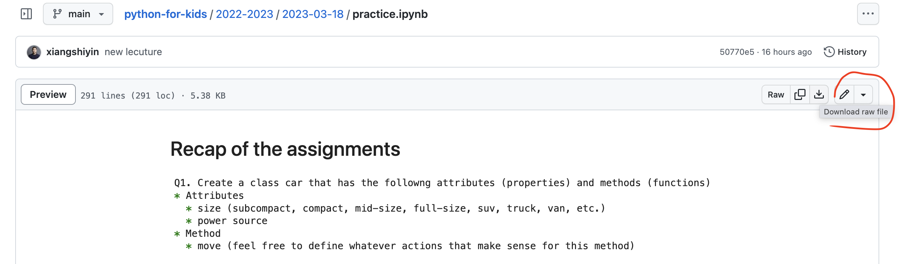

**Table of Contents**
- [Access the course materials](#access-the-course-materials)
  - [General access](#general-access)
  - [Advanced access](#advanced-access)
    - [Option 1 - Via `git` commands from command line](#option-1---via-git-commands-from-command-line)
    - [Option2 - Via `GitHub Desktop`](#option2---via-github-desktop)
- [Course Materials](#course-materials)
  - [Planned topics and lecture materials](#planned-topics-and-lecture-materials)
  - [File structure](#file-structure)

# Access the course materials
## General access
* You can browse the course materials by visiting https://github.com/xiangshiyin/python-for-kids
* You can download the whole course package follow the pattern below 
* You can download individual files follow the pattern below 
## Advanced access
Course materials will be frequently updated online, so manual download methods described above might not be so convenient. In order to always stay up to date, you can utilize `git` to simplify the process.

### Option 1 - Via `git` commands from command line
* Check the note [here](..//2022-2023/2023-01-28/README.md#git) to install and set up `git` 
* Navigate to the directory where you want to download the course material from terminal
* Follow the pattern below to copy the url and run command `git clone <the url you just copied>` to download the whole course repository from github to your local directory 
* To fetch the updates
  * Run command `cd python-for-kids` from terminal to navigate to course material folder
  * Run command `git pull` to get the course materials up to date

### Option2 - Via `GitHub Desktop` 
* Check the note [here](..//2022-2023/2023-01-28/README.md#git) to install and set up `git`
* Download desktop software `GitHub Desktop` via https://desktop.github.com/
* Clone the remote repo follow the pattern below 
  * You need to put in the url of the course repo and select a local path to host the downloaded course materials
* Fetch the latest updates from the software to make the course material folder up to date

# Course Materials
## Planned topics and lecture materials
You can access the planned lecture topics and materials for each lecture follow the pattern below. 

## File structure
Below is the general structure of the lecture materials:
* `README.md` contains the high level description of the lecture topics, the suggested reading materials, and coding assignments. Its content will be automatically rendered on the webpage when you navigate into the lecture folder within Github
* `practice.ipynb` contains the executable code examples demonstrated in our class

