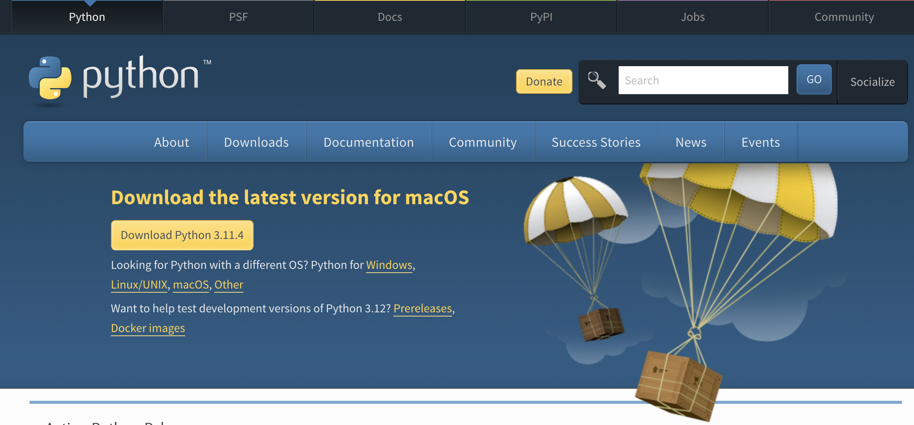

- [Software and Tools (编程工具)](#software-and-tools-编程工具)
  - [Internet @ ACCA](#internet--acca)
  - [Local coding tools](#local-coding-tools)
    - [Option 1: `Python` application (**RECOMMENDED**)](#option-1-python-application-recommended)
    - [Option 2: `Anaconda` (a package with `Python` application and all commonly used python libraries for analytics and modeling)](#option-2-anaconda-a-package-with-python-application-and-all-commonly-used-python-libraries-for-analytics-and-modeling)
  - [Online coding tools](#online-coding-tools)
    - [`replit`](#replit)
    - [Google Colab (notebook)](#google-colab-notebook)
    - [Github Codespace](#github-codespace)

# Software and Tools (编程工具)

You can pick either local or online programming tools to practice coding. Please follow the instructions below accordingly to set up the coding environment before our class.

您可以选择线下或者线上的编程工具实现编程练习和操作，请您按照下列方式在课前设置好编程环境。如果您遇到问题可以联系老师，我们可以一起想办法解决。

## Internet @ ACCA
If you choose online coding tools, you would need internet connections during our class. Please follow the instructions [here](https://docs.google.com/document/d/11eFQRPvOztVvnZBlLF-Yvn--7tIW3Yin) to connect the wifi network in the school campus
* **You would need to recreate internet connection credentials every 7 days**

如果您选择线上工具，您需要在上课时用电脑上网，相应的联网方式可以按照[这里](https://docs.google.com/document/d/11eFQRPvOztVvnZBlLF-Yvn--7tIW3Yin)的说明。
* **您需要每隔7天重设一次网络登录账户**

**Since internet connection is not so convenient in the ACCA campus, local coding tools below are PREFERRED.**

## Local coding tools

### Option 1: `Python` application (**RECOMMENDED**)
Install "vanilla" version `Python` application to your local computer
* Please download `Python` via the link https://www.python.org/downloads/
  * You can choose the corresponding link to download the version that matches your computer's operation system 
### Option 2: `Anaconda` (a package with `Python` application and all commonly used python libraries for analytics and modeling)
Install the well packaged Python toolset to your local computer
* Please download Anaconda via this link: https://www.anaconda.com/products/distribution. You can download link when you scroll to the bottom of the web page. Please choose the installer that's compatible to your computer operation system
  * For Mac OS user, you can download `64-Bit Graphical Installer (591 MB)`
  * For windows user with a 64-bit operation system, you can download `64-Bit Graphical Installer (594 MB)`
  * For Windows user with a 32-bit operation system, you can download `32-Bit Graphical Installer (488 MB)`

## Online coding tools
### `replit`
Please head to https://replit.com, sign up a free account, and log in the account. They provide a free in-browser coding environment for 50+ programming languages including Python. Depending on our internet connections in the school campus, we will see if this could an option. 

您可以通过在线编程网站 https://replit.com 创建免费账户然后在其中编写调试程序。如果我们的场地网络信号允许，我们可以尝试这一方案。**希望您课前**提前注册好账户，并且登录相应的账户。这个工具的好处是您无需在本地电脑安装任何软件，可以直接在浏览器界面编写程序。

### Google Colab (notebook)
* For general information on Google Colab, check https://colab.research.google.com/
* You can execute the notebook code samples under each lecture folder posted via the  button listed to run the notebook on Google Colab in your browser (you may need to have a google account in order to use Google Colab)
* You can also directly open Google Colab notebooks and write code

### Github Codespace
* Github now also provides a free codespace to run the whole code repository (including the notebook code samples) in your browser. Check [here](https://github.com/features/codespaces) for more information.